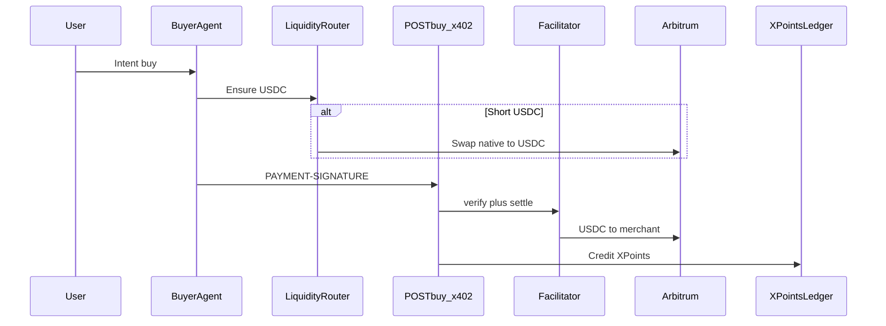

# Borneo × Arbitrum Open House

Source of truth for this prototype. Landing copy, demo script, and product decisions should map here.

**Design read:** cinematic product landing for Arbitrum Open House judges — intent-native commerce on Arbitrum (Syne + IBM Plex, jade / ember / ink).

**Dials:** `DESIGN_VARIANCE: 6` · `MOTION_INTENSITY: 5` · `VISUAL_DENSITY: 4`

**Primary track:** Build a Market

---

## Problem

Users hold fragmented assets. Buying merch, tokenized RWAs, or micro-payments usually means manual swaps, gas friction, and separate rails. Agent commerce catalogs are also walled — merchants listing only inside a few chat apps are invisible to the long tail of agents.

**Challenge framing:** An AI shopping agent bridges natural-language intent to **Arbitrum liquidity routing** and **USDC x402 settlement** on Arbitrum, then shares protocol upside back as **XPoints** so users switch for seamless conversion *and* earn rewards.

---

## Expected submissions (map 1:1)

| Pillar | What we ship | Live surface |
|---|---|---|
| **AI Agent Layer** | Intent buyer agent — clarify, search, compare, hand off to pay | `/buyer` |
| **Liquidity routing** | Balance check + Uniswap V3 quote/execute (native → USDC) before settle | Consent modal + `/api/liquidity` |
| **Merchant access** | Chat onboard → published agent storefront (+ RWA desk SKUs) | `/onboard`, `/market` |
| **Seamless payment** | USDC x402 on Arbitrum (in-process x402 facilitator) + optional Visa rail | `/buyer` checkout |
| **XPoints flywheel** | Protocol fee bps → XPoints + invite boost | `/buyer/xpoints` |
| **Trust / consent** | Preview + authorize; locked quote; catalog cannot change payee/amount | Consent modal |

Do not claim voice unless we ship it. Vertical: fashion + tokenized/RWA demo listings.

---

## Demo path (judges)

1. `/` landing: fragmented balances → intent → route → settle → earn
2. `/buyer`: **"Weekend outfit"** (or "Buy this drop" / RWA) → multi-store picks
3. Consent / cart: **liquidity map** — mixed `quoteCurrency` (WETH/ETH display) → USDC settle (hackathon-safe); optional `ALT_SETTLE_TOKEN` for full multi-asset
4. Authorize → x402 settle per store → explorer receipt → XPoints earned
5. Optional: `POST /s/{slug}/buy` 402 challenge + `/buyer/xpoints` invite loop

Fail-soft: missing `BUYER_PRIVATE_KEY` still shows the 402 challenge. Missing DEX liquidity shows a **plan** route and settles when USDC is funded.

Outfit demo stores: `/s/atelier-tee`, `/s/harbor-caps`, `/s/stride-kicks`.

---

## Architecture (short)

- **Buyer agent:** `/buyer`, `/api/buyer-chat` — discovers via `/llms.txt` + registry
- **Liquidity:** `/api/liquidity` + `src/lib/liquidity/route.ts` — Uniswap V3 on Arbitrum One
- **Crypto rail:** HTTP 402 → USDC on Arbitrum → x402 facilitator settle
- **XPoints:** app-layer fee rewards (merchant still receives full listed USDC)

---

## Trust model

1. Buyer sees a **transaction preview** (item, merchant, amount, route, rail).
2. Buyer **confirms** (`Authorize purchase`). No confirm, no charge.
3. x402: payTo + atomic amount must match the locked quote.
4. XPoints are **not** a token or a security — a demo rewards ledger funded conceptually by the protocol fee.
5. Protocol log is visible so the handshake is inspectable.

---

## Landing page contract

- Shopper: `Shop with Borneo` → `/buyer`
- Sellers: `Publish a storefront` → `/onboard`
- Hero thesis: intent → route → settle → earn on Arbitrum
