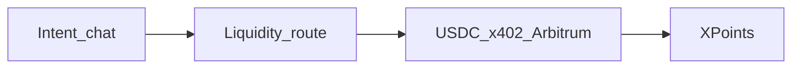

<div align="center">

# Borneo

[](#borneo)
[](#borneo)
[](#borneo)
[](https://nextjs.org/)

**Intent → route → settle → earn. AI shopping agents that pay in USDC on Arbitrum.**

Landing → [http://localhost:3000](http://localhost:3000) · Setup → [`scripts/setup-arbitrum-usdc.md`](./scripts/setup-arbitrum-usdc.md)

</div>

---

## The problem

Users hold fragmented assets. Buying products, tokenized RWAs, or micro-payments usually means manual swaps and separate rails. Agent catalogs are often walled inside a few chat apps, and agents have no safe, open way to pay merchants.

## Borneo @ Arbitrum Open House

**An AI-native shopping agent** takes natural-language intent, **routes liquidity** into USDC, **settles with x402 on Arbitrum**, and credits **XPoints** from a protocol micro-fee — so conversion is seamless *and* users earn rewards. Any HTTP agent can shop any Borneo store: the store answers `402 Payment Required`, the agent signs a USDC authorization, and settlement lands on Arbitrum in one round trip.



| Step | Surface |
|---|---|
| Intent | `/buyer` salesperson + `GET /api/search` |
| Route | `GET/POST /api/liquidity` · Uniswap V3 quote (Arbitrum One) · outfit liquidity map |
| Buy (x402) | `POST /s/{slug}/buy` → **402** → sign EIP-3009 → settle on Arbitrum |
| Earn | `/buyer/xpoints` · invite `?ref=` boost |
| Outfit demo | `/s/atelier-tee` · `/s/harbor-caps` · `/s/stride-kicks` |
| RWA demo | `/s/arbitrum-rwa-desk` tokenized claim SKUs |
| Skills | [`.agents/skills/borneo-registry-shop`](./.agents/skills/borneo-registry-shop/SKILL.md) |

**Do not scrape HTML.** Catalog prose never enters the pay path — settle only sees a locked quote (`storeSlug`, `skuId`, `price`, `merchantAddress`). XPoints are a rewards ledger driven by the protocol fee (not a token or security).

### How settlement works on Arbitrum

1. `POST /s/{slug}/buy` without payment returns `402` with a `PAYMENT-REQUIRED` header: `exact` scheme, `eip155:421614`, amount, asset (USDC or Paxos USDG), and `payTo` = the **BorneoCheckout** contract. `extra` carries the merchant, the on-chain order key and the **order-bound nonce**.
2. The buyer agent signs an EIP-3009 `ReceiveWithAuthorization` for exactly that amount, to the checkout, using that nonce.
3. Borneo's x402 facilitator verifies signature, balance, amount, time window and nonce off-chain, then relays `BorneoCheckout.settle(...)` (relayer pays gas, buyer needs no ETH).
4. The contract pulls the funds, pays the merchant `amount − fee`, sends the fee to the treasury, credits on-chain XPoints and emits `OrderSettled`. The receipt carries the Arbiscan `txHash` and the on-chain fee split.

Without `CHECKOUT_ADDRESS`, Borneo falls back to a direct `TransferWithAuthorization` to the merchant.

## Smart contract: `BorneoCheckout`

[`contracts/src/BorneoCheckout.sol`](./contracts/src/BorneoCheckout.sol) is a non-custodial x402 settlement contract for agent payments (Foundry, OpenZeppelin v5, Solidity 0.8.24).

| | |
|---|---|
| Arbitrum Sepolia | [`0xf8188490C10d0248DBB27bD1A07F8a7b4f0e9fc4`](https://sepolia.arbiscan.io/address/0xf8188490C10d0248DBB27bD1A07F8a7b4f0e9fc4) · [verified source (Blockscout)](https://arbitrum-sepolia.blockscout.com/address/0xf8188490C10d0248DBB27bD1A07F8a7b4f0e9fc4?tab=contract) |
| Deploy tx | [`0xe1a2dec5…370f`](https://sepolia.arbiscan.io/tx/0xe1a2dec59a5af884e4eac74959f1795369472408fc80016f2d15f7ff41dd370f) |
| Settled purchase (USDC via checkout) | [`0x698479ad…3545`](https://sepolia.arbiscan.io/tx/0x698479add48aa055711965108a33457357465d4e36897029f96300757fa23545) — 0.02 USDC → 0.0199 merchant + 0.0001 treasury, 100 XPoints |
| Allowlisted assets | Circle USDC, **Paxos USDG** |

**Why a contract instead of a plain transfer?** With `TransferWithAuthorization`, whoever holds the signature can submit it, and nothing on-chain ties the payment to an order. BorneoCheckout fixes that:

- **Order-bound nonce.** The EIP-3009 nonce must equal `keccak256(ORDER_TYPEHASH, chainId, checkout, orderId, merchant, token, amount)`. A relayer cannot redirect funds to another merchant, change amount or token, or reuse the signature for a different order. Changing any field breaks either the nonce check or the token's signature check.
- **Front-run safe.** `ReceiveWithAuthorization` can only be redeemed by the payee (the checkout), so the signature cannot be lifted from the mempool and replayed against the token directly.
- **Exactly-once orders.** Each `orderId` settles once (`OrderAlreadySettled`); token-level nonces stop replays across contracts.
- **On-chain fee split + XPoints.** `fee = amount × feeBps / 10 000` (hard cap 10%) goes to the treasury, the rest to the merchant in the same tx; the payer's `xpoints` accrue 1:1 with fee units. The contract never holds a balance after settlement; a balance-delta check guards against non-standard tokens.
- **Ops safety.** `Ownable2Step`, `Pausable`, `ReentrancyGuard`, `SafeERC20`, token allowlist, custom errors, `sweep` for stray tokens.

**Tests:** 22 unit tests + 1 000-run fuzz (value conservation) against a mock EIP-3009 token, covering redirect, recomputed nonce, amount/token swap, random nonce, double settle, front-running, expiry, wrong payer, pause and admin paths, plus **fork tests that settle through the real Arbitrum Sepolia USDC and Paxos USDG contracts**.

```bash
cd contracts
forge test                                                      # unit + fuzz
forge test --match-contract Fork --fork-url https://sepolia-rollup.arbitrum.io/rpc   # real USDC + USDG
DEPLOYER_PRIVATE_KEY=0x… forge script script/DeployBorneoCheckout.s.sol --rpc-url https://sepolia-rollup.arbitrum.io/rpc --broadcast
```

End-to-end against a running server: `npx tsx --env-file=.env scripts/e2e-checkout.mts http://localhost:3000 atelier-tee`.

---

## Try it

```bash
npm install
cp .env.example .env
# Fill BUYER_PRIVATE_KEY, MERCHANT_ADDRESS, Firebase, OPENAI
# Fund the buyer with Arbitrum Sepolia USDC + a little ETH
# See scripts/setup-arbitrum-usdc.md
npm run dev
```

| Path | What it is |
|---|---|
| `/` | Landing — intent → route → settle → earn |
| `/merchant` · `/onboard` | Seller chat → publish agent storefront |
| `/buyer` | Intent chat → route preview → USDC / Visa |
| `/buyer/xpoints` | XPoints balance + friend invite loop |
| `/market` | Marketplace index (fashion + RWA desk) |
| `/api/search?q=` | Intent search |
| `/api/liquidity?price=` | Liquidity route preview |
| `/registry.json` | Network store index |
| `/demo` | Judge handshake script |

### Env (see [`.env.example`](.env.example))

| Var | Purpose |
|---|---|
| `OPENAI_API_KEY` | Agents + embeddings search |
| `NEXT_PUBLIC_FIREBASE_*` | Buyer + merchant auth |
| `CHAIN_NETWORK` | `eip155:421614` (Arbitrum Sepolia, default) or `eip155:42161` (Arbitrum One) |
| `BUYER_PRIVATE_KEY` | Server-side x402 signing |
| `FACILITATOR_PRIVATE_KEY` | Optional relayer for settlement gas (defaults to buyer key) |
| `MERCHANT_ADDRESS` | Default merchant payTo (`0x…`) |
| `CHECKOUT_ADDRESS` | BorneoCheckout contract; when set, all x402 payments settle through it |
| `ALT_SETTLE_TOKEN` / `ALT_SETTLE_SYMBOL` | Second settle asset (defaults to Paxos USDG) |
| `PROTOCOL_FEE_BPS` | Fee in bps (default `50`); match the contract's `feeBps` |
| `TREASURY_ADDRESS` | Fee recipient (the checkout's `treasury`) |

### Contract / asset references

| Asset | Address |
|---|---|
| USDC (Arbitrum Sepolia) | [`0x75faf114eafb1BDbe2F0316DF893fd58CE46AA4d`](https://sepolia.arbiscan.io/token/0x75faf114eafb1BDbe2F0316DF893fd58CE46AA4d) |
| USDC (Arbitrum One) | [`0xaf88d065e77c8cC2239327C5EDb3A432268e5831`](https://arbiscan.io/token/0xaf88d065e77c8cC2239327C5EDb3A432268e5831) |
| Paxos USDG (Arbitrum Sepolia) | [`0xFFC95faa3d63Cde504a05B567C600B78C0b41892`](https://sepolia.arbiscan.io/token/0xFFC95faa3d63Cde504a05B567C600B78C0b41892) |
| Paxos USDG (Arbitrum One) | [`0x004B506865409877C9fA29bfb1ebA929984B9bbC`](https://arbiscan.io/token/0x004B506865409877C9fA29bfb1ebA929984B9bbC) |
| BorneoCheckout (Arbitrum Sepolia) | [`0xf8188490C10d0248DBB27bD1A07F8a7b4f0e9fc4`](https://sepolia.arbiscan.io/address/0xf8188490C10d0248DBB27bD1A07F8a7b4f0e9fc4) |
| Explorer | `https://sepolia.arbiscan.io` |

### Scripts

| Command | Purpose |
|---|---|
| `npm run dev` | Local Next.js |
| `npm run build` / `npm start` | Production |
| `npm run lint` | ESLint |

---

## Submission checklist (Arbitrum Open House Buildathon)

- [ ] Public repo + this README
- [ ] Live product URL
- [ ] Demo video 2–4 min: intent → route → settle USDC on Arbitrum → earn XPoints (+ optional RWA SKU)
- [x] Smart contract deployed on Arbitrum Sepolia, tested (unit + fuzz + fork) and verified
- [x] Arbiscan links for at least one settled purchase (see Smart contract section)
- [ ] Submit by the Buildathon deadline (Oct 4, 2026)

See [`docs/submission.md`](./docs/submission.md) for the shot list.
