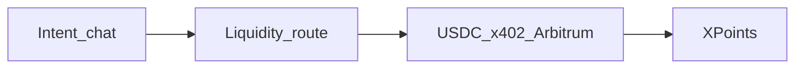

<div align="center">

# Borneo

[](#borneo)
[](#borneo)
[](#borneo)
[](https://nextjs.org/)

**Intent → route → settle → earn. AI shopping agents that pay in USDC on Arbitrum.**

Landing → [http://localhost:3000](http://localhost:3000) · Setup → [`scripts/setup-arbitrum-usdc.md`](./scripts/setup-arbitrum-usdc.md)

</div>

---

## The problem

Users hold fragmented assets. Buying products, tokenized RWAs, or micro-payments usually means manual swaps and separate rails. Agent catalogs are often walled inside a few chat apps, and agents have no safe, open way to pay merchants.

## Borneo @ Arbitrum Open House

**An AI-native shopping agent** takes natural-language intent, **routes liquidity** into USDC, **settles with x402 on Arbitrum**, and credits **XPoints** from a protocol micro-fee — so conversion is seamless *and* users earn rewards. Any HTTP agent can shop any Borneo store: the store answers `402 Payment Required`, the agent signs a USDC authorization, and settlement lands on Arbitrum in one round trip.



| Step | Surface |
|---|---|
| Intent | `/buyer` salesperson + `GET /api/search` |
| Route | `GET/POST /api/liquidity` · Uniswap V3 quote (Arbitrum One) · outfit liquidity map |
| Buy (x402) | `POST /s/{slug}/buy` → **402** → sign EIP-3009 → settle on Arbitrum |
| Earn | `/buyer/xpoints` · invite `?ref=` boost |
| Outfit demo | `/s/atelier-tee` · `/s/harbor-caps` · `/s/stride-kicks` |
| RWA demo | `/s/arbitrum-rwa-desk` tokenized claim SKUs |
| Skills | [`.agents/skills/borneo-registry-shop`](./.agents/skills/borneo-registry-shop/SKILL.md) |

**Do not scrape HTML.** Catalog prose never enters the pay path — settle only sees a locked quote (`storeSlug`, `skuId`, `price`, `merchantAddress`). Merchant still receives the **full listed USDC**; XPoints are an app-layer rewards ledger driven by `PROTOCOL_FEE_BPS` (not a token or security).

### How settlement works on Arbitrum

1. `POST /s/{slug}/buy` without payment returns `402` with a `PAYMENT-REQUIRED` header: `exact` scheme, `eip155:421614`, USDC amount, merchant `payTo`.
2. The buyer agent signs an EIP-3009 `TransferWithAuthorization` for exactly that amount (USDC domain `USD Coin` / `2`).
3. Borneo's in-process x402 facilitator verifies signature, balance, amount, recipient and time window, then relays `transferWithAuthorization` on Arbitrum.
4. The response carries the Arbiscan `txHash`; the order is marked paid and XPoints accrue.

---

## Try it

```bash
npm install
cp .env.example .env
# Fill BUYER_PRIVATE_KEY, MERCHANT_ADDRESS, Firebase, OPENAI
# Fund the buyer with Arbitrum Sepolia USDC + a little ETH
# See scripts/setup-arbitrum-usdc.md
npm run dev
```

| Path | What it is |
|---|---|
| `/` | Landing — intent → route → settle → earn |
| `/merchant` · `/onboard` | Seller chat → publish agent storefront |
| `/buyer` | Intent chat → route preview → USDC / Visa |
| `/buyer/xpoints` | XPoints balance + friend invite loop |
| `/market` | Marketplace index (fashion + RWA desk) |
| `/api/search?q=` | Intent search |
| `/api/liquidity?price=` | Liquidity route preview |
| `/registry.json` | Network store index |
| `/demo` | Judge handshake script |

### Env (see [`.env.example`](.env.example))

| Var | Purpose |
|---|---|
| `OPENAI_API_KEY` | Agents + embeddings search |
| `NEXT_PUBLIC_FIREBASE_*` | Buyer + merchant auth |
| `CHAIN_NETWORK` | `eip155:421614` (Arbitrum Sepolia, default) or `eip155:42161` (Arbitrum One) |
| `BUYER_PRIVATE_KEY` | Server-side x402 signing |
| `FACILITATOR_PRIVATE_KEY` | Optional relayer for settlement gas (defaults to buyer key) |
| `MERCHANT_ADDRESS` | Default merchant payTo (`0x…`) |
| `PROTOCOL_FEE_BPS` | XPoints accrual rate (default `50`) |
| `TREASURY_ADDRESS` | Fee narrative address |

### Contract / asset references

| Asset | Address |
|---|---|
| USDC (Arbitrum Sepolia) | [`0x75faf114eafb1BDbe2F0316DF893fd58CE46AA4d`](https://sepolia.arbiscan.io/token/0x75faf114eafb1BDbe2F0316DF893fd58CE46AA4d) |
| USDC (Arbitrum One) | [`0xaf88d065e77c8cC2239327C5EDb3A432268e5831`](https://arbiscan.io/token/0xaf88d065e77c8cC2239327C5EDb3A432268e5831) |
| Explorer | `https://sepolia.arbiscan.io` |

### Scripts

| Command | Purpose |
|---|---|
| `npm run dev` | Local Next.js |
| `npm run build` / `npm start` | Production |
| `npm run lint` | ESLint |

---

## Submission checklist (Arbitrum Open House Buildathon)

- [ ] Public repo + this README
- [ ] Live product URL
- [ ] Demo video 2–4 min: intent → route → settle USDC on Arbitrum → earn XPoints (+ optional RWA SKU)
- [ ] Arbiscan links for at least one settled purchase in the video or README
- [ ] Submit by the Buildathon deadline (Oct 4, 2026)

See [`docs/submission.md`](./docs/submission.md) for the shot list.
